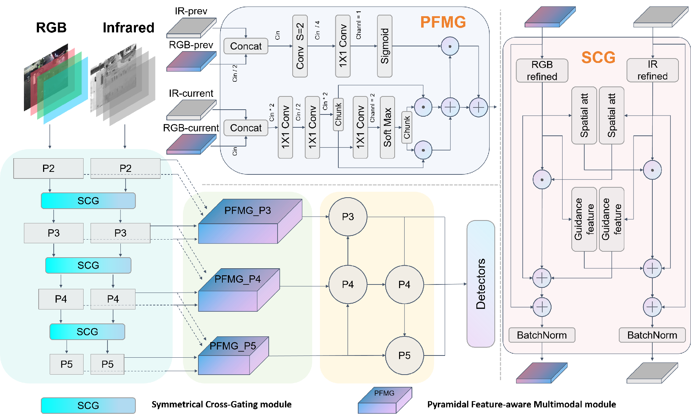
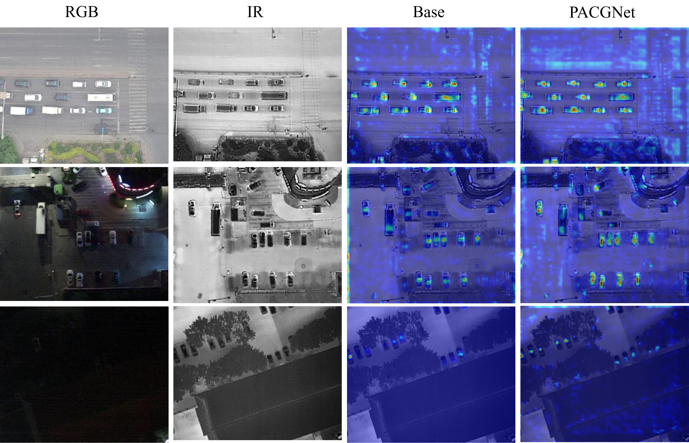

# PACGNet: Pyramidal Adaptive Cross-Gating for Multimodal Detection  


## 📄 Paper Information  
- **arXiv Link**: [arXiv:2512.18291](https://arxiv.org/abs/2512.18291)  
- **Field**: Computer Vision and Pattern Recognition (`cs.CV`)  


## 🎯 Key Experimental Results  
| Dataset       | mAP50 (Test Set) | Note                  |  
|---------------|------------------|-----------------------|  
| DroneVehicle  | 82.2%            | State-of-the-Art (SOTA) |  
| VEDAI         | 82.1%            | State-of-the-Art (SOTA) |  


## 📊 Dataset Access  
The datasets used in the experiments are available through the following channels:  

### Original Datasets  
- **DroneVehicle** (RGB-Infrared cross-modal vehicle detection):  
  [Official VisDrone Repository](https://github.com/VisDrone/DroneVehicle)  
- **VEDAI** (Benchmark for small object detection in aerial imagery):  
  [Official Greyc Download Page](https://downloads.greyc.fr/vedai/)  


### Preprocessed Datasets (Ready-to-Train)  
- **Quark Cloud Disk**:  
  [Download Link](https://pan.quark.cn/s/097092895eb4) (26.5GB, includes preprocessed annotations and images)  


## 📖 Core Contributions  
This paper focuses on **multimodal (RGB-Infrared) object detection in aerial imagery**. To address two critical issues in existing methods—**cross-modal noise interference** and **destruction of the feature pyramid hierarchy (impacting small object detection)**—we propose the **Pyramidal Adaptive Cross-Gating Network (PACGNet)**. The core designs include two modules:  

1. **Symmetric Cross-Gating (SCG) Module**:  
   Employs bidirectional horizontal gating to selectively fuse complementary information from two modalities, while suppressing noise and preserving the semantic integrity of individual modalities.  

2. **Pyramid Feature-aware Multimodal Gating (PFMG) Module**:  
   Reconstructs the feature pyramid via "top-down" hierarchical gating, using fine-grained information from high-resolution layers to guide fusion in low-resolution layers, thus avoiding loss of small object details.  


Ultimately, PACGNet achieves state-of-the-art performance on both the DroneVehicle (81.7% mAP50) and VEDAI (82.1% mAP50) datasets. Additionally, the model is lightweight (5.2M parameters), balancing accuracy and efficiency.  


## 📊 Visualization Results  

### 📐 Model Architecture Diagram  
Illustrates the hierarchical structure of the Pyramidal Adaptive Cross-Gating Network:  
  
*Figure 1: Connection of core modules (Symmetric Cross-Gating + Pyramid Feature-aware Multimodal Gating). A dual-stream backbone extracts RGB/Infrared features in parallel, which are then interacted via SCG and fused via PFMG before feeding into the detection head.*  


### 🎯 Multimodal Detection Results  
Visualization of predictions on the DroneVehicle dataset:  
  
*Figure 2: Qualitative comparison on the VEDAI dataset. Our PACGNet demonstrates comprehensive improvements over the baseline. It not only reduces false negatives and suppresses false positives/classification errors, but also provides more precise localization for correctly identified targets.*  


### 🔥 Feature Heatmap Analysis  
Feature response distribution of key model layers (Highlighted areas indicate target regions of interest):  
  
*Figure 3: Visualization comparing feature activations: Original images, Baseline heatmaps, and PACGNet heatmaps. PACGNet demonstrates enhanced focus encompassing the entire vehicle relative to the Baseline.*  


## 📚 Citation  
If this work is helpful to you, please cite it using the following BibTeX:  

```bibtex
@misc{gu2025pyramidal,
      title={Pyramidal Adaptive Cross-Gating for Multimodal Detection}, 
      author={Zidong Gu and Shoufu Tian},
      year={2025},
      eprint={2512.18291},
      archivePrefix={arXiv},
      primaryClass={cs.CV},
      doi={10.48550/arXiv.2512.18291}
}
